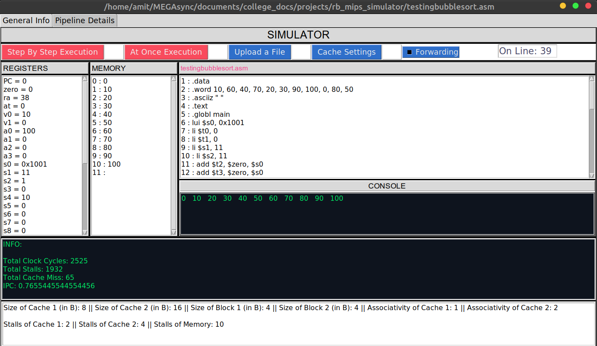
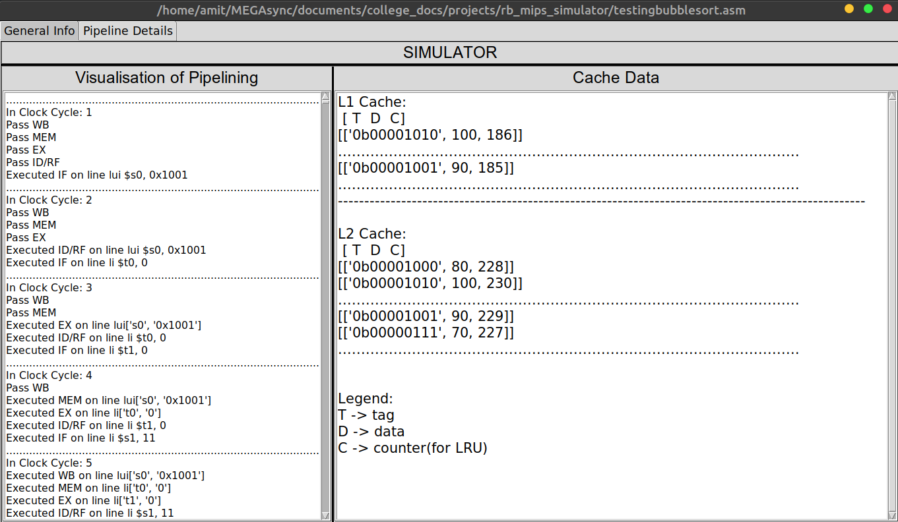

# rb_mips_simulator

### Developers:
* Amit Kesari (CS19B003)
* Anu Anand Annu (CS19B044)

### Simulate MIPS Instruction Set Architecture along with implemention of Pipeline and Cache 

*ScreenShots*

###PHASE 1:
* Main starting file is **gui.py** located in phase 1 folder
* The simulator supports the following MIPS instructions: 
  * add/sub
  * bne/beq
  * jmp
  * lw/sw
  * lui
  * addi  
  * sll/srl
  * li/la
  * slt
  * jr
  * syscall
  
* The simulator supports at least 4 KB of memory.
* The simulator reads in an assembly file(.asm), executes the instructions, and in the end display
the contents of the registers, and the memory.
* Language used for development: Python.
* The GUI for the simulator has been developed to be simplistic and functional using Tkinter. 
* Tries to point out syntax errors and shows erroneous line. 

---

### PHASE 2:
In phase 2, we are implementing pipeline so that the throughput can be increased.

* The main file is **pipeline.py** in phas2 directory.
* All 5 stages (IF, ID/RF, EX, MEM, WB) have been modularised.
* Stalls (*nop*) have been added according to data dependencies only.
* *nop* instructions are pushed into the next Hardware Unit whenever stalls are found.
* Stalls are found on the basis of last three instructions performed.
* Structural hazards have been removed assuming writing in 1st half of the cycle and reading in 2nd half of the cycle.
* Without Data Forwarding:
    * Stall will come after dependency, and instr will resume on same cycle after executing WB
        2 stalls will come in case of dependency.
    * With Data Forwarding:
        Stall will come but we can data forward in EXE-MEM for add, sub, etc....and in MEM-WB for lw, sw, etc...
        0-1 stall will come in case of dependency.

* We tried implementing all the 5 HW units as objects and tried to find and accumulate the stalls based on the data dependency between the instructions.
* We tried to compare and jump to that instruction point in the ID/RF stage itself.
* Enabling/Disabling of data forwarding is implemented which will be asked before running the program.
* Data forwarding is done by updating EX_REGISTERS whenever execute operation is performed and used only when the data in it is different from original REGISTERS.
* Work for GUI for this simulator is just started.

---

### PHASE 3:
In phase 3, we are introducing L1 L2 levels of Cache

* The main file is **gui.py** which contains all the gui required for this project.
* File **cache.py** contains all the functions required for cache hits, replacements and stall returning.
* File **pipeline.py** contains all the functions required for pipelining.
* File **simu.py** contains all the functions required for simulation i.e., all the instructions of programming.
* A memory access will now first search for the address in the two caches. On a miss, the data
will be fetched from the main memory.
* This simulator simulating 2 levels of cache, with LRU replacement policy and Cache inclusion policy is implemented.
* This effectively means that the memory instructions (load and stores) will not be completed
in one cycle.
* Loads and Stores will have variable latency, and hence the penalty (stalls) due to the memory
access is variable.
* Cache size, Associativity, No. of stalls and penalty can all be changed and simulated.
  
### GUI Details:
* **At Once Execution** button is for running the file.
* **Upload a File** button is for uploading the file. It is multiple executable. For each execution, a file must be uploaded.
* **Cache Settings** button is for changing the properties of the Cache. If not changed, it will remain default value. Default or updated values are shown in the bottom-most part of the gui.
* **Forwarding** checkbutton is for enabling/disabling the forwarding.
* **On Line** will show which line is being executed.
* There are two frames for displaying information.
    * ### General Information:
        * **REGISTERS**: It shows the data stored in Registers.
        * **MEMORY**: It shows the data stored in Memories.
        * **USER TEXT**: It shows the text of the text file uploaded which is to be executed.
        * **CONSOLE**: It shows the data printed in the console.
        * **INFO**: It shows the details of "Total Clock Cycles", "Total Stalls", "Total Cache Miss" and "IPC".
    * ### Pipeline Details:
        * **Visualisation of Pipeling**: It shows the details i.e., work done by each virtual hardware in each clock cycle.
        * **Cache Data**: It shows the data stored in the Cache.
    
### How to run?
1) Run **gui.py**.
2) Dialog box will open.
3) Upload a file from **Upload a File** button.
4) Enable forwarding if required form **Forwarding** checkbutton.
5) Change Cache properties from **Cache Settings** button if required.
6) Steps 3, 4 and 5 can be done in any manner. It is written in most suitable way.
7) Run the program by clicking on **At Once Execution** button.
8) To execute again, repeat the steps from step 3.

---

### Future Improvements
* Step by Step Execution can be added.
* GUI can be made more interactive.
* Run time error detection can be added properly.

<b> - Work by Team Robotic Billa</b>

    
        

